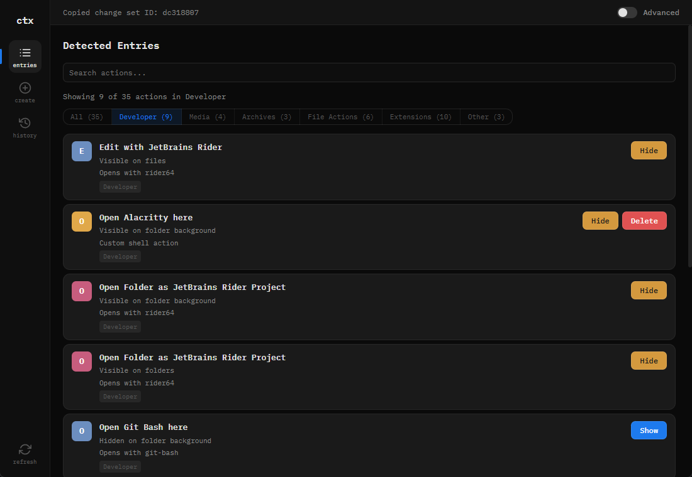
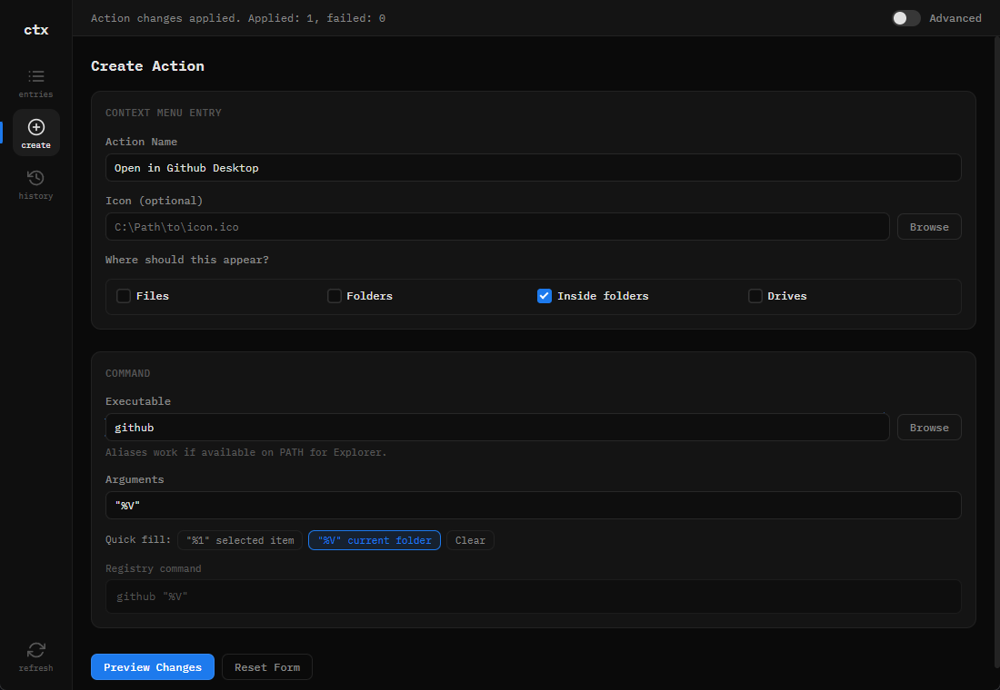

# Context Menu Helper

A Windows desktop application for safely managing Explorer right-click context menu entries. Built with Rust and Tauri 2.


## Why?

Over time, installed software adds entries to the Windows right-click context menu — Git Bash, archive tools, media players, IDEs, and more. The menu becomes cluttered, and cleaning it up typically means manually editing the Windows Registry, which is risky and hard to undo.

Context Menu Helper provides a safe, visual way to:

- **Discover** all context menu entries from the registry
- **Disable** unwanted entries without deleting them
- **Create** custom context menu actions
- **Roll back** any change using automatic backups

No entries are ever deleted. The app uses the `LegacyDisable` registry strategy to hide entries, and every change is tracked with UUID-based change sets that can be fully reverted.

## Features

- **Registry scanning** — Reads `HKCU` and `HKCR` shell entries, resolves CLSIDs, and detects shell extensions
- **Smart categorization** — Groups entries into Developer, Media, Archives, File Actions, Extensions, System, and Other
- **Search & filter** — Find entries by name, command, or category
- **Suggested actions** — Identifies known problematic entries (e.g. duplicate Git Bash variants) and recommends disabling them
- **Custom actions** — Create new context menu entries for files, folders, drives, or desktop background with extension filtering and argument presets
- **Change history** — Every applied change is logged with a UUID, timestamp, and full registry backup
- **Rollback** — Revert any change set to restore the registry to its previous state
- **Advanced mode** — Toggle visibility of technical details like registry paths and keys

## Screenshots

| Detected Entries | Create Action |
|:---:|:---:|
|  |  |

## Getting Started

Download the latest installer from [GitHub Releases](https://github.com/frinky04/context-menu-helper/releases). Run the `.msi` or portable `.exe` — no additional dependencies required.

Requires Windows 10 or later.

## Development

### Prerequisites

- [Rust](https://rustup.rs/) (stable toolchain)
- [Tauri 2 prerequisites](https://v2.tauri.app/start/prerequisites/) (MSVC build tools on Windows)

### Run in development

```bash
cargo tauri dev
```

### Build for production

```bash
cargo tauri build
```

The installer and portable executable will be in `src-tauri/target/release/bundle/`.

### Run core tests

```bash
cargo test -p context_menu_core
```

## Project Structure

```
context-menu-helper/
├── core/                  # Reusable Rust engine
│   └── src/
│       ├── models.rs      # Data types (MenuEntry, ProposedChange, ChangeSetRecord)
│       ├── registry.rs    # RegistryProvider trait & Windows implementation
│       ├── service.rs     # Business logic (scan, apply, rollback)
│       ├── templates.rs   # Change builders (toggle, create action)
│       ├── validation.rs  # Input validation for custom actions
│       ├── log_store.rs   # UUID-based change set persistence (JSON)
│       └── mock_registry.rs  # Test mock
├── src-tauri/             # Tauri desktop shell
│   ├── src/main.rs        # Command handlers bridging UI to core
│   └── tauri.conf.json    # App configuration
└── ui/                    # Frontend (vanilla HTML/CSS/JS)
    ├── index.html
    ├── main.js
    └── styles.css
```

**Architecture:** Business logic lives in `core/` and is framework-agnostic. The Tauri shell in `src-tauri/` is a thin adapter that exposes core functions as IPC commands. The frontend in `ui/` is static with no build step.

## How It Works

### Scan & Disable

1. App scans safe registry paths for shell menu entries
2. Entries are displayed grouped by category with search and filters
3. Click disable on any entry — the app sets `LegacyDisable` in the registry
4. A change set is created with a full backup of the previous state

### Create Custom Action

1. Fill in the form: name, executable, icon, target types, extensions
2. Preview the registry changes that will be made
3. Apply — the entries are written to the registry with automatic backup

### Rollback

1. Open the History panel to see all applied change sets
2. Select any change set to view its details
3. Click rollback to restore the registry from the saved backup

## Tech Stack

| Layer | Technology |
|-------|-----------|
| Core engine | Rust (`winreg`, `serde`, `uuid`, `chrono`, `anyhow`) |
| Desktop shell | Tauri 2 |
| Frontend | Vanilla JS, HTML, CSS |
| Font | IBM Plex Mono |

## Notes

- Registry operations are **Windows-only**. On other platforms, registry commands return explicit errors. The core library compiles cross-platform for testing with mock registries.
- The app never deletes registry keys — it only disables/enables them, ensuring all changes are reversible.
- Change sets are stored as JSON files in the user's local app data directory.
